# :star2:Tuan Shop :star2:

Thiết kế và phát triển website thương mại điện tử **Tuan Shop** về bán quần áo

## Chủ đề :bell:

Chủ đề : **Website thương mại điên tử bán quần áo**. :tshirt:

## Công nghệ được sử dụng :floppy_disk:

- :+1: Sử dụng các ngôn ngữ lập trình web cơ bản như **_HTML_**, **_SCSS_** và **_Javascript_**.

## Công việc chính :globe_with_meridians:

Về **Front-end** :arrow_forward::

- [ ] Thiết kế trang chủ

#### Giao diện Homepage :point_right:

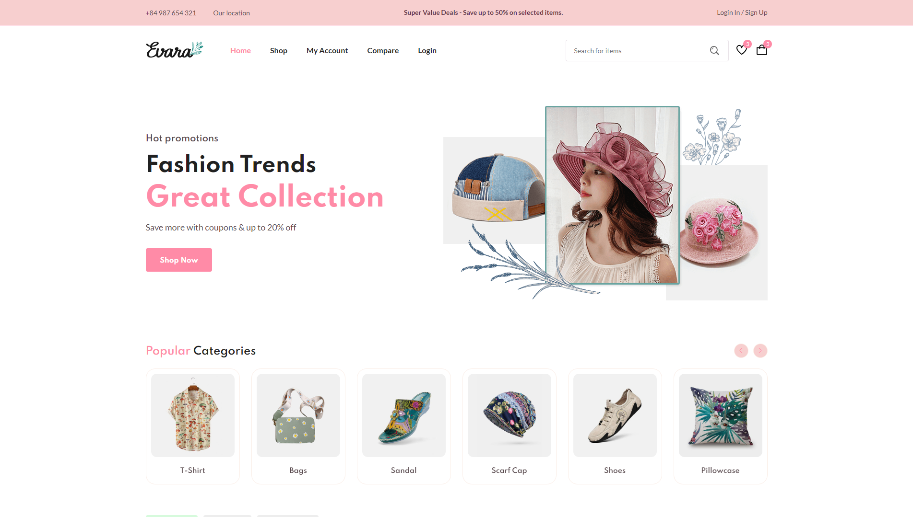
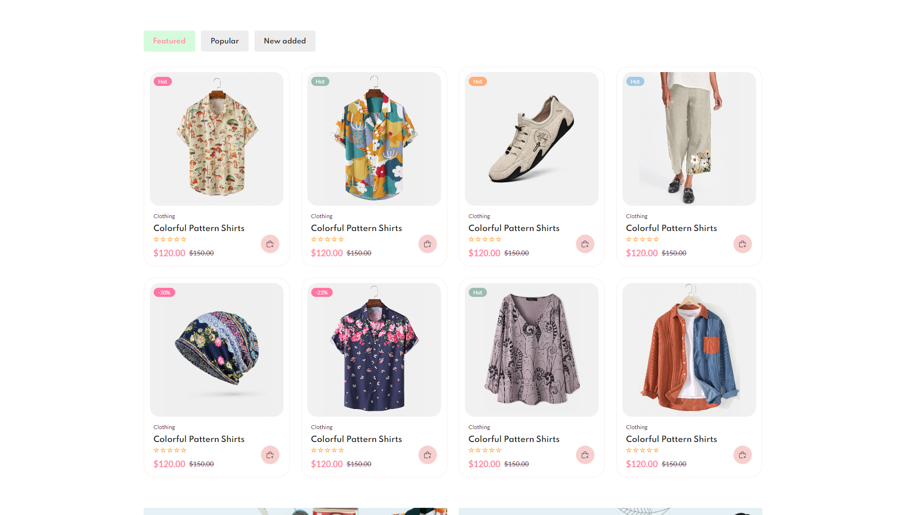
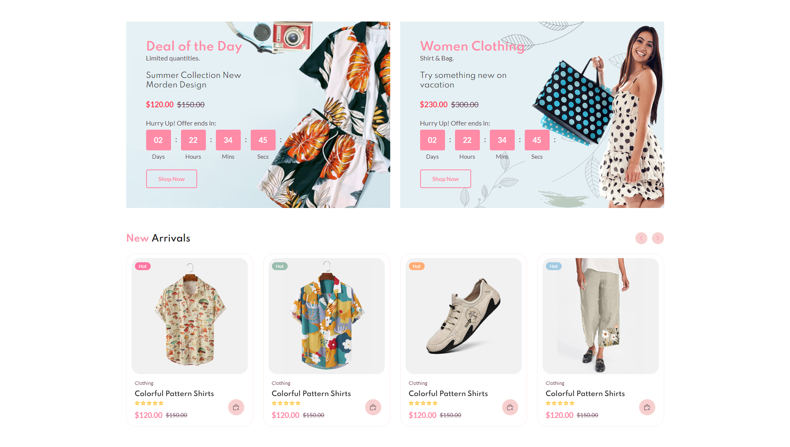
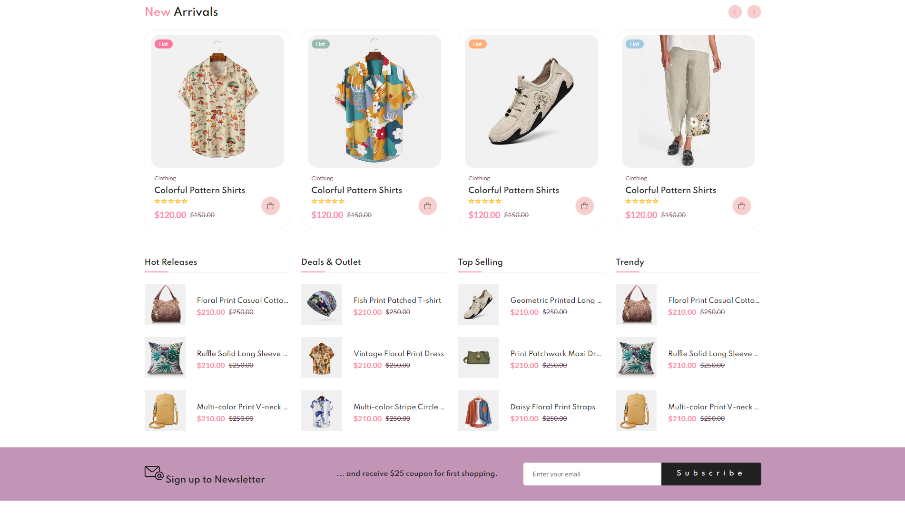
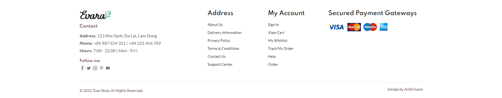

- [ ] Thiết kế trang sản phẩm

#### Giao diện Sản phẩm :point_right:

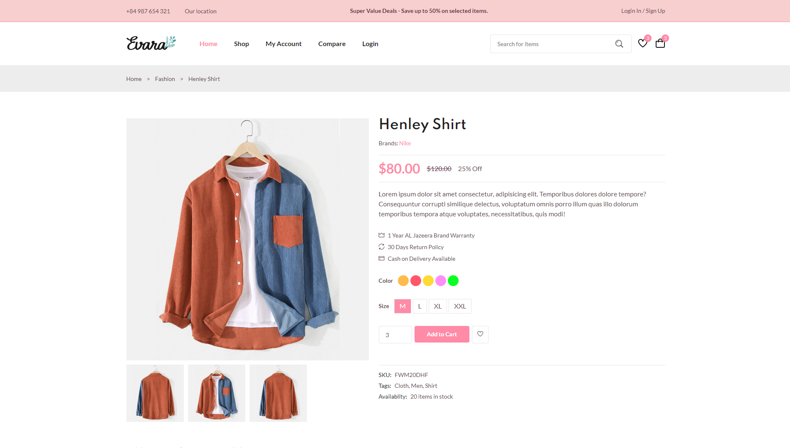
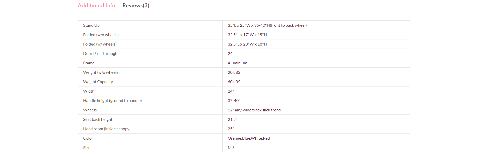
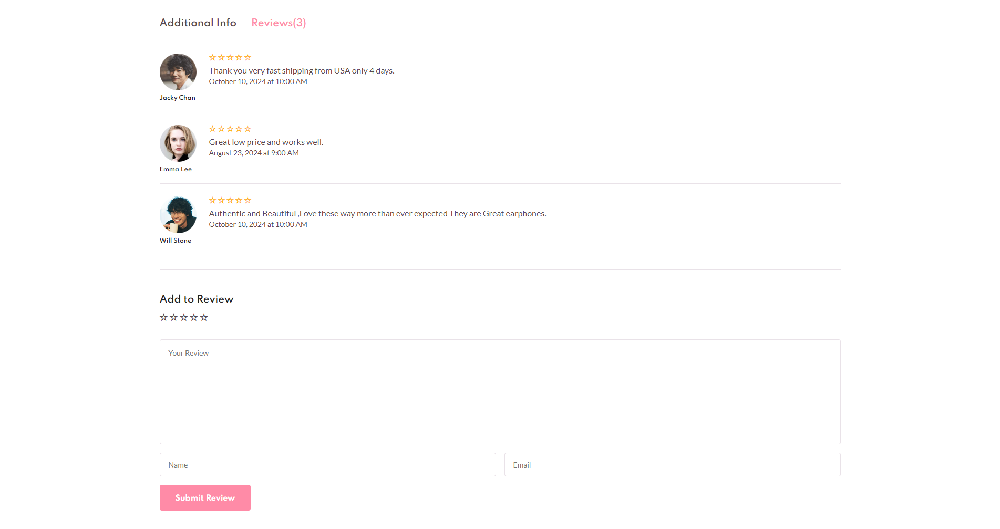

- [ ] Thiết kế trang giỏ hàng

#### Giao diện Giỏ hàng :point_right:

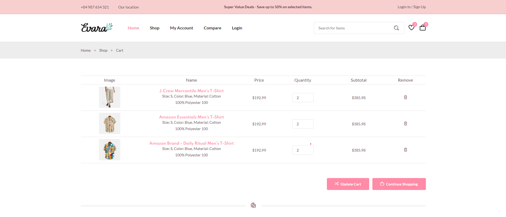
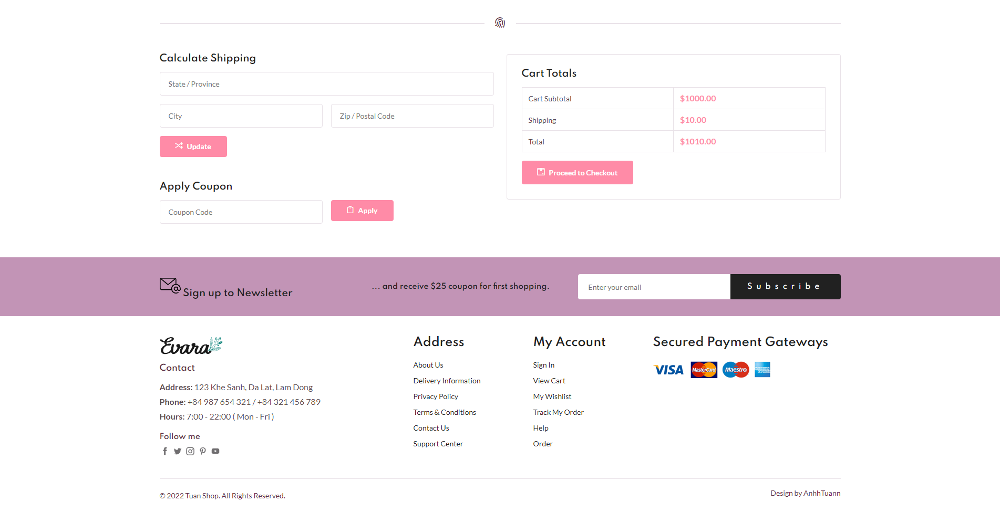

- [ ] Thiết kế các trang thanh toán (gồm trang chọn phương thức thanh toán, hoàn tất thanh toán)

#### Giao diện Thanh toán :point_right:

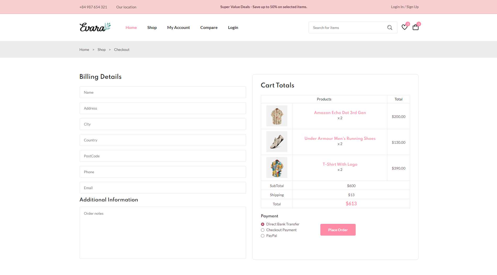

- [ ] Thiết kế trang đăng ký / đăng nhập

#### Giao diện Đăng ký / Đăng nhập :point_right:

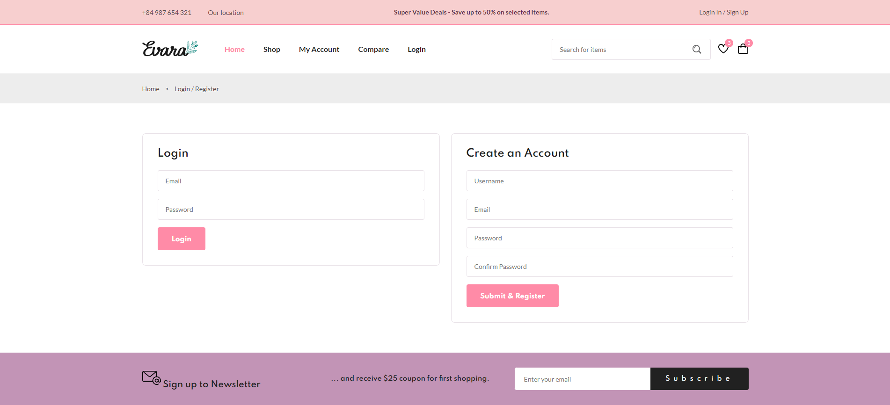

- [ ] Thiết kế trang hồ sơ người dùng

#### Giao diện Hồ sơ người dùng :point_right:

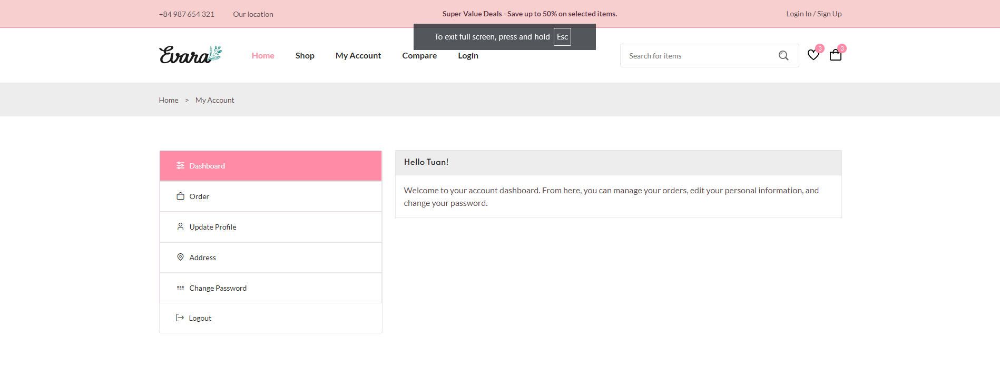

- [ ] Thiết kế trang xem đơn hàng

#### Giao diện Xem đơn hàng :point_right:

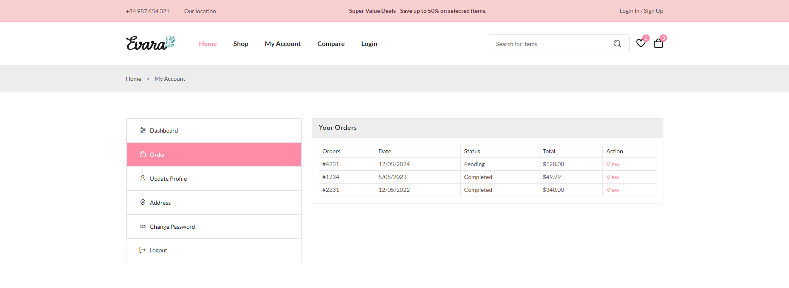

- [ ] Thiết kế trang so sánh sản phẩm

#### Giao diện So sánh sản phẩm :point_right:

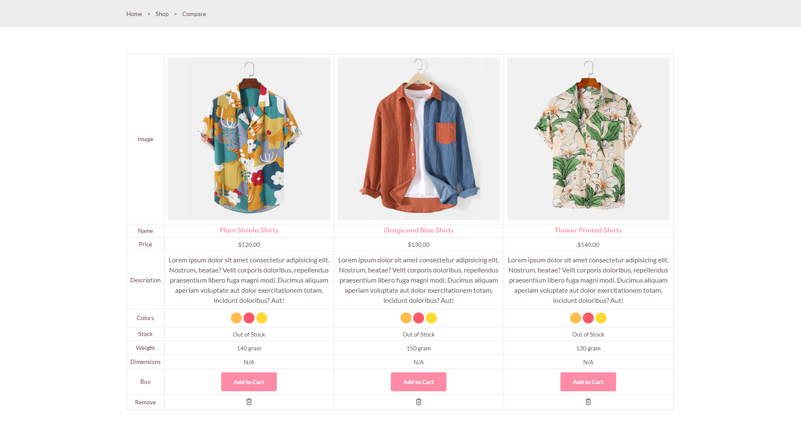

## Tổng kết :page_with_curl:

- Website thương mại điện tử **Tuan Shop** được thiết kế và phát triển với ngôn ngữ lập trình web cơ bản **_HTML_**, **_SCSS_** và **_Javascript_**.
- Trang chủ, trang sản phẩm, trang giỏ hàng, trang thanh toán, trang đăng ký/đăng nhập, trang hồ sơ người dùng, trang xem đơn hàng, trang so sánh sản phẩm được thiết kế đầy đủ và có chất lượng cao.
- Các trang được thiết kế đơn giản, dễ đọc, dễ hiểu, có thể dễ dàng mở rộng để thêm nội dung, tùy biến theo nhu cầu của khách hàng.
- Các trang được thiết kế với mục tiêu đem lại sự thoải mái cho khách hàng khi mua hàng trên website.
